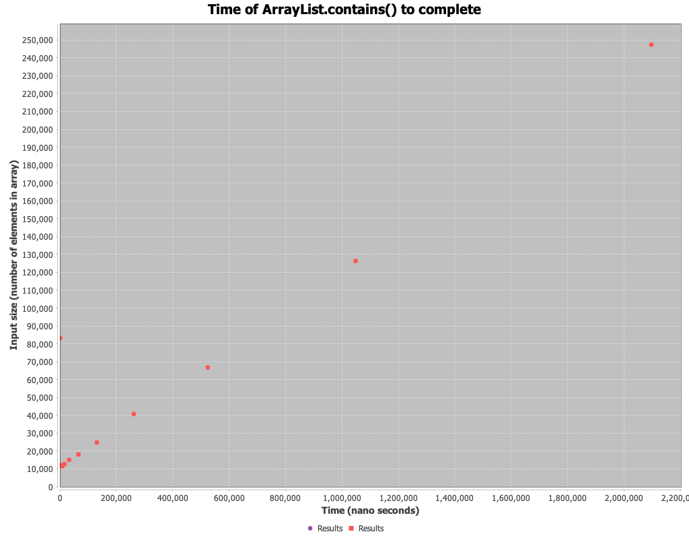

### Question 1 - Backing the sorted set with a Java List
1. If I backed the sorted set with a Java List instead of an array, the primary differences follow:
   * The overall implementation would be simpler in terms of code complexity as a java List contains methods which I could invoke instead of writing from scratch. For example, List.contains().
   * Java List's preserve the order, so I would not have to concern myself with ensuring order is preserved upon adding or removing items from the list
   * Java's List's allow duplicate values, so I would need to wrap the list to ensure duplicates cannot be added
2. Using the Java List would be more efficient for the following reasons:
   * Development time:
     1. Functionality I wrote from scratch, such as `contains` and various sections of code that aid in preserving the order of the elements would not be needed, as it is already built in to the List object.
     2. Since there is functionality I can use out of the box, this would reduce the amount tests I would need to write.
   * Run time:
     1. Java Lists have refined and well tested search/sorting algorithms that aid in preserving the sorted order. These algorithms are likely faster than my binary search and accompanying code implementation to enforce this order.

### Question 2 - Big-O of `contains`
1. I expect the `contains` method to be `O(Log n)`. This is because the contains method only relies on executing binary search once and checking the output value. Since binary search uses a single loop that repeatedly divides the search interval in half, this results in the `log n` behavior.

### Question 3 - Time analysis of `contains`

The growth rate in this plot does not match my prediction of `O(Log n)` above. 
Rather, it looks more linear (`O(n)`).

### Question 4 - 
