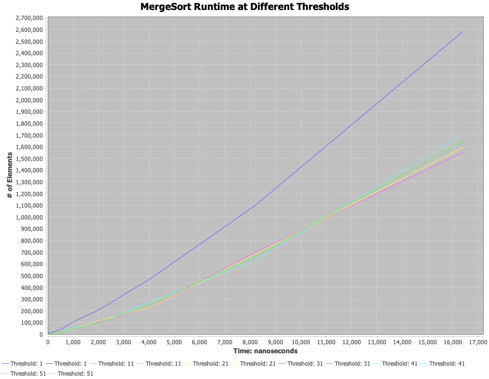
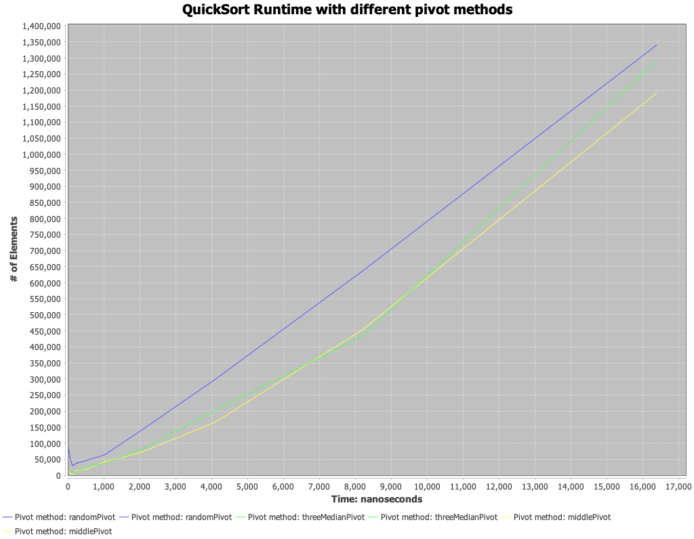
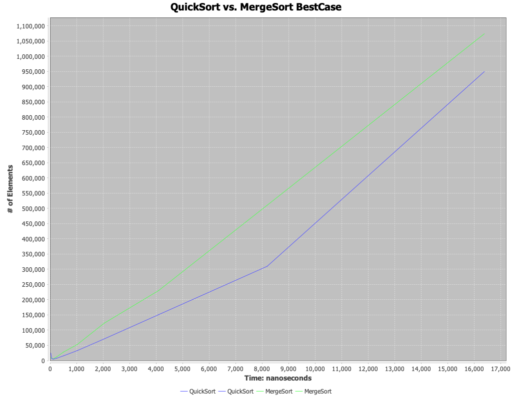
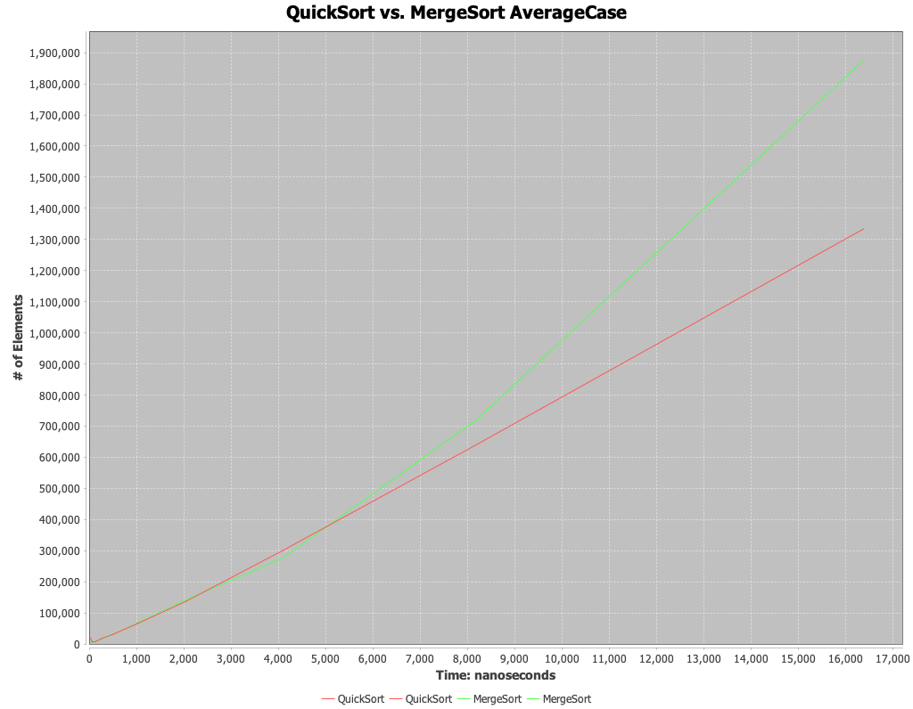
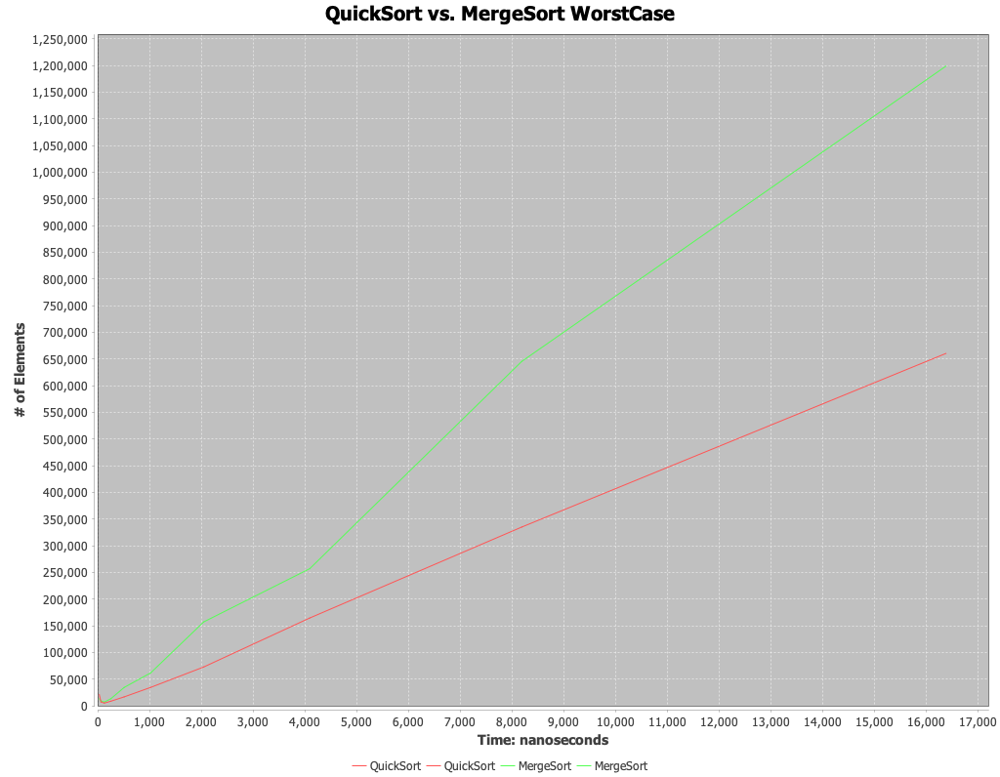

# Assignment 4 Analysis

Team member: Alexia Pappas

**Note:** Several of the graphs have duplicated labels.
This was something we were unable to debug in time, the data plotted is just one series per duplicated label pair. 
So, please ignore the extra labels. 

## MergeSort Threshold Experiment

`Threshhold: 1` represents a full mergesort.
This means the sub arrays in merge sort have been split into length 1 and results in no running of the insertion sort loop.
The following thresholds increase by increments of 10.
The fastest threshold appeared to be `Threshhold: 1` (i.e. the purely merge sort method).

The remaining thresholds, which do utilize insertion sort, are relatively similar with a few notable points of variation:

| time point (ns) | Fastest threshold | Slowest threshold |
|-----------------|-------------------|-------------------|
| 4000            | 41                | 21                |
| 8000            | 31                | 51                |
| 16000           | 41                | 31                |

`Threshhold: 41` appears be the fastest most often, but not by much.
The remaining thresholds are all very close to each other, and one is not a clear winner.
With their values being so close, I am skeptical that the variations between the thresholds are meaningful and rather can be attributed to noise in the experiment.

I did not expect to see use of insertion sort to be slower at all thresholds than not using insertion sort. 
However, all thresholds have a similar trend, so the addition of insertion sort does not appear to have an impact significant enough to chane the big O of mergeSort.

## Quicksort Pivot Experiment

The random pivot choice was consistently the fastest.
However, the three median pivot method displays an accelerating trend after ~8200 nanoseconds. 
If we were run the experiment with larger inputs, it could be possible that the three median method could overtake the random choice.
It is encouraging to see the three median pivot begin to outperform the middle pivot method, as there is a higher probability (3 choices vs. 1) of choosing a good pivot point to help reduce the number of recursive steps which can lead to the best case of Quick sort (`O(n log n)`). 

## Mergesort vs. Quicksort Experiment

In all cases, merge sort outperformed quick sort, except for a small period of time between ~2500 ns and 5000ns in the average case.
Merge sort nearly doubled the performance of quick sort at the higher inputs in the worst case.

In the worst case I did expect merge sort to outperform quick sort as merge sort guarantees an `O(n log n)` time complexity, whereas quick sort cannot guarantee the same time complexity with a best case of `O(n log n)` and a worst case of `O(n^2)`.
Although the worst case of quick sort rarely occurs, I would expect a small lead from merge sort but not a completely different time complexity, which the worst case experiment seems to support.
Interestingly, if you view the trends together from best -> average -> worst you can see the gap between merge sort and quick sort grows.
I did expect to see this trend at higher numbers, since quick sort does not have the same big O guarantee as merge sort and providing less and less ideal cases could lower probability that quick sort finds an ideal pivot.

I am surprised to see merge sort consistently outperforming quick sort as quicksort has a reduced number of constant operations due to it working in-place.
Of course, the reduction of constant operations doesn't affect the big O, but it does provide small optimizations that I would have expected to show more often, especially in smaller inputs as we do see in the smaller inputs in the average case.
