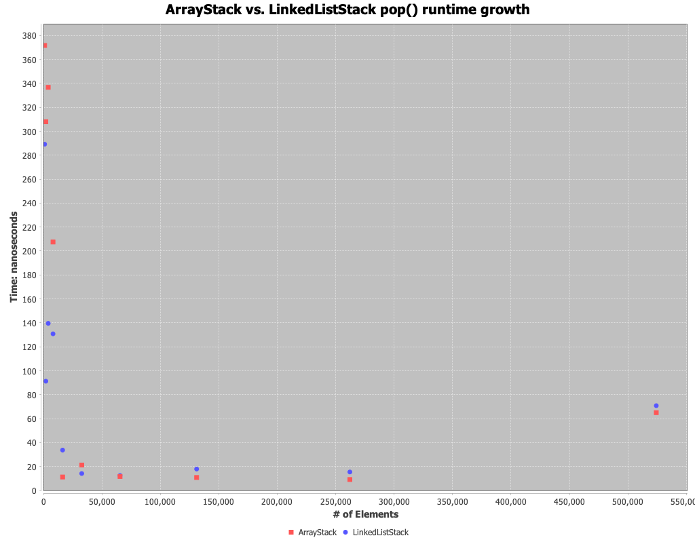

# Stack runtime analysis

For each of the following stack methods, what is the growth rate and why?

## Push method

Overall the growth rate seems to be `O(1)` with quite a bit of variation in the lower input sizes.
The variation is largely amongst the `ArrayStack` as at lower input sizes, there is a greater chance that the array needs to grow, which would lead to longer execution times.
The `LinkedListStack` is a bit more consistent, however, it does seem to *typically* be slower at the larger input sizes. 
My hunch is this is due to the larger overhead of allocating memory for a new node.
Whereas, if the array has sufficient space available, we only need to insert the new element into the array.

## Pop method

Similar to the `push` method, the growth rate seems to be `O(1)` and there is notable variation at lower input sizes, particularly within the `ArrayStack`.
Since there is not array growth done within the pop method, I am a bit surprised to see a similar trend as with the `push` method.
However, it is encouraging to see the variation exists with the `linkedListStack` since they should be fairly similar.
My guess is the experiment is not controlling for noise well and is introducing some false variation.
We also see the same trend that the ArrayStack is faster at larger input sizes, but just slightly.

## Peek method

The `peek` method displays a growth rate of `O(1)` and has a few notable differences with the `pop` and `push` methods above.
Like the `pop` method, we see more variation amongst the `linkedListStack` than the `push` method. 
Additionally, `peek` does not require array growth, so I would expect the `linkedListStack` to perform closely to the `ArrayStack` which they appear to do.
Unlike both the `pop` and the `peek` methods, we eventually see the `LinkedListStack` outperforms the `ArrayStack` at higher input counts.
I believe this is due to the `linkedListStack` holding a direct reference to the first element vs. needing to index into the array to the first element in the `ArrayStack`.

### Which stack class is more efficient for the web browser application

Across each method, it sees the `LinkedListStack` slightly outperforms the `ArrayStack` at smaller input sizes.
Although it seems the `ArrayStack` will generally outperform the `LinkedListStack` at larger input sizes, I believe the `LinkedListStack` is best suited for the browser application.
This is because users will likely never have larger active history numbers, thus, the performance would be noticed mostly in lower input sizes.
Since the array needs to grow repeatedly at lower input sizes, it will lead to a better user experience to use the `LinkedListStack`.
