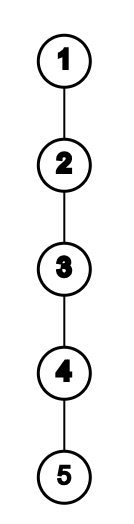
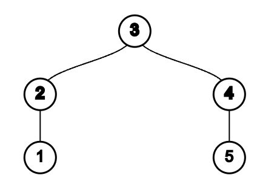
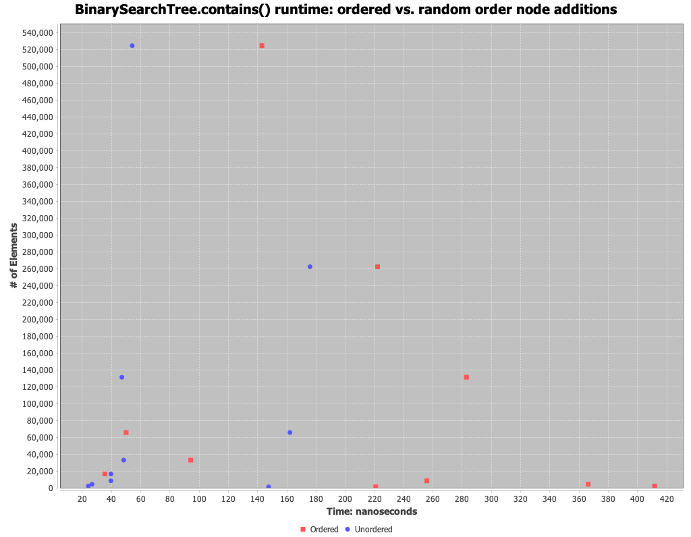
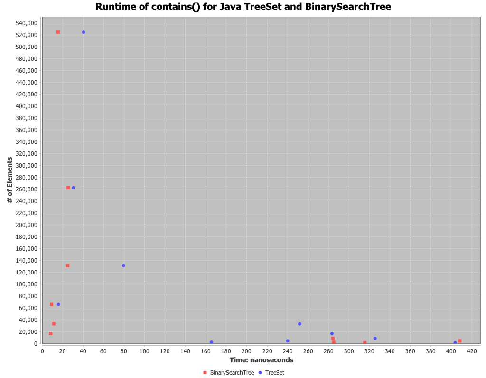
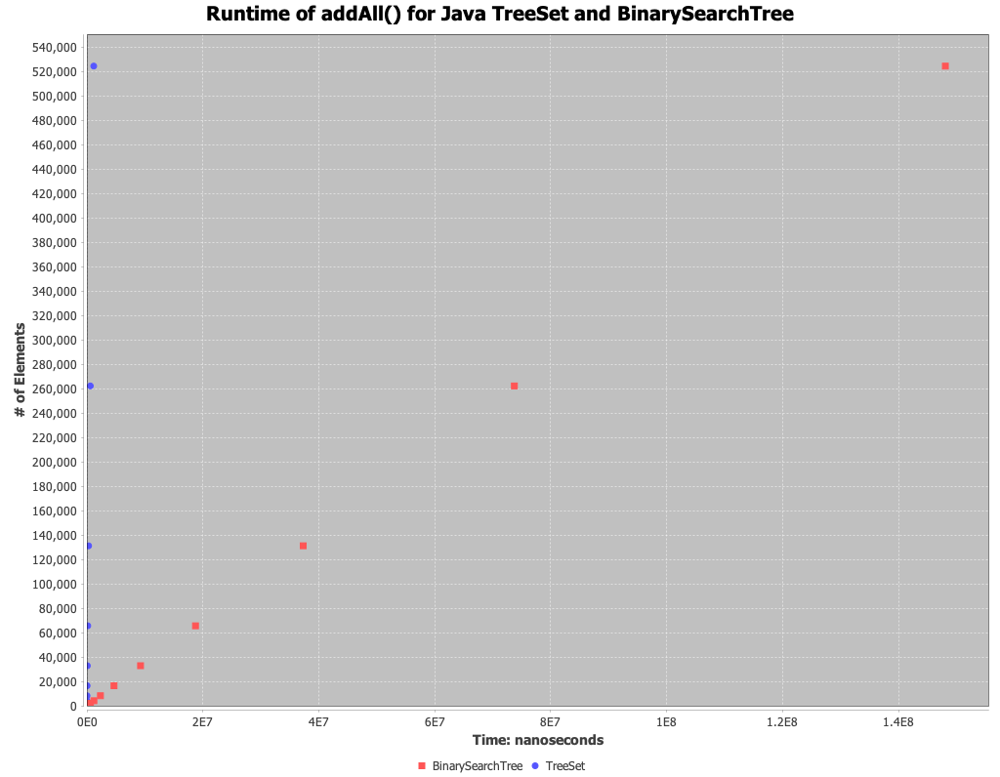

# Assignment 6 Analysis

## Question 1

The order of the items added to the tree determines the tree's balance. 
For example, if you add an already ordered set of elements to a BST sequentially, you would end up with essentially a linked list (a single line of nodes occupying only right sides of nodes).
Adding in this order
```
{1, 2, 3, 4, 5}
```
results in



Whereas if you, add them with the order `3, 2, 1, 4, 5`, this results in



This occurs due to the rule of binary search trees that the smaller elements of a node are contained in the node's left subtree, whereas the larger items are in the node's right subtree.
When a new node is added, the above rule is followed, and it is attached to an existing node that has no children.

This construction of the tree affects the runtime of subsequent calls of methods that require traversing the tree.
In the case of `add`, `contains`, and `remove` the runtime of each reduce from the first order case to the second order case.
For example, if you want to `add`, `remove`, or check for the containment of `6`, then you would have to iterate through 5 elements in the first case vs. 3 elements in the second case to get to node `5`.
Overall, adding elements in an order that reduces the height of the tree allows methods to reduce the number of nodes they need to iterate through.

## Experiment 1: Runtime effect of sorted vs. random sorted tree additions

To observe the effect that the order of node additions has on methods which traverse the tree, I measured the runtime of the `contains` against a tree built with nodes added in ascending order and a tree built with nodes added in random order.
Both trees contained the same set of node values, the only difference is the order in which the values were added.
Each call to `contains` checked for a value which was randomly chosen from the same set of values the tree was built from.
The runtime was tested with the following input sizes: `{ 1024, 2048, 4096, 8192, 16384, 32768, 65536, 131072, 262144, 524288 }`.
The runtime of `contains` was averaged over 100 separate calls.



The graph above shows the largest runtimes being held by the tree built using ordered additions, supporting that the tree built with a random order of nodes should have faster traversal times.
Interestingly, for input sizes `16384` and `65536`, the ordered set outperformed the unordered set.
This is likely due to the random order being less ideal than the sorted for the given numbers that were search for, meaning the height of the subtree containing said number was larger in the random order than the sorted order.
Overall, since these cases are the minority, we can conclude that a BST built from random node insertions will likely be faster to traverse than a BST built from additions in sorted order.

## TreeSet vs. BinarySearchTree

To compare the `TreeSet` and `BinarySearchTree` I ran two experiements.
1. Comparing the runtime of calling the `contains()` method on populated `TreeSet`s and `BinarySearchTree`s. Both of which where populated with the same set of values and order.
2. Compare the runtime of calling `addAll()` to populate either the `TreeSet` or the `BinarySearchTree`. Both are populated using the same random ordered set of values.

Both of the experiments were run with the input sizes of `{ 1024, 2048, 4096, 8192, 16384, 32768, 65536, 131072, 262144, 524288 }`.
The runtime of each method was average over 100 separate calls for each input.





Overall it appears the `TreeSet` has much better performance for inserting nodes into the tree than the `BinarySearchTree`.
I did expect this as the traversal time for a TreeSet should be faster than the traversal time of the `BinarySearchTree`, given the `TreeSet` balances the tree upon addition, thus simplifying the subsequent add operations.
I am surprised to see the `TreeSet` perform similarly to the `BinarySearchTree` with the contains method.
I would have expected traversal to be faster with the `TreeSet` since the tree is balanced.

## Question 5

I think a `BST` is a decent data structure for a dictionary.
However, it could get a bit unruly as a single tree.
Storing information on top of the tree, such as the root node of all words starting with `b` would be helpful so one could jump around the tree vs. needing to traverse large portions of it before finding the section of the tree where a word starting with `b` likely is.
Since there is other information that could be used to speed up searching for a word, then it seems the structure is wasting time by enforcing some unnecessary traversal.
The tree structure is still better than say, a linked-list which would force `O(N)` searching, but it does seem limiting in being able to used other information on top of the tree to speed up searching.

## Question 6

Inserting the words in alphabetical order will lead to a long linear chain of nodes, that is effectively a linked list.
This will lead to longer traversal times, enforcing `O(n)`, because there is no bidirectional branching and we will have to visit every node when traversing the tree.
This is the same problem highlighted in Question 1 above.
To fix the problem you could insert the words in random order or attempt to pre-sort the insertions so they create a somewhat balances tree.
