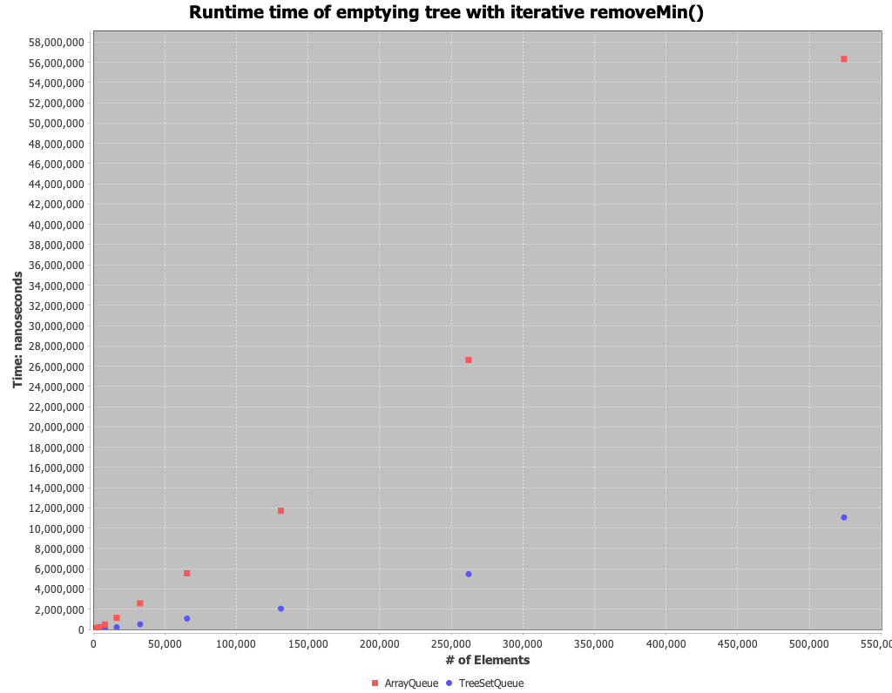

# Lab 6 Analysis

# Questions
1. `TreeSet` is writing the permuted set slower than ordered set. Red black trees should be faster with permuted set
2. I wouldn't expect a big difference between `TreeSet` and `ArrayQueue` on construction. Add for `ArrayQueue` is `O(n)` worst case and `TreeSet` guarantees `O(log n)`
3. Cost of delete is similar `O(log n)` but we see a big difference

## Experiment 1 - Tree Construction

In both cases it appears the Array-backed min heap priority queue (`ArrayQueue`) had higher performance than the `TreeSet` backed priority queue.
Both the `ArrayQueue` and `TreeSet` priority queues performed slower when being constructed with a permuted set vs. being constructed with an ascending ordered set.
The trend makes sense as 

## Experiment 3 - Tree Destruction

