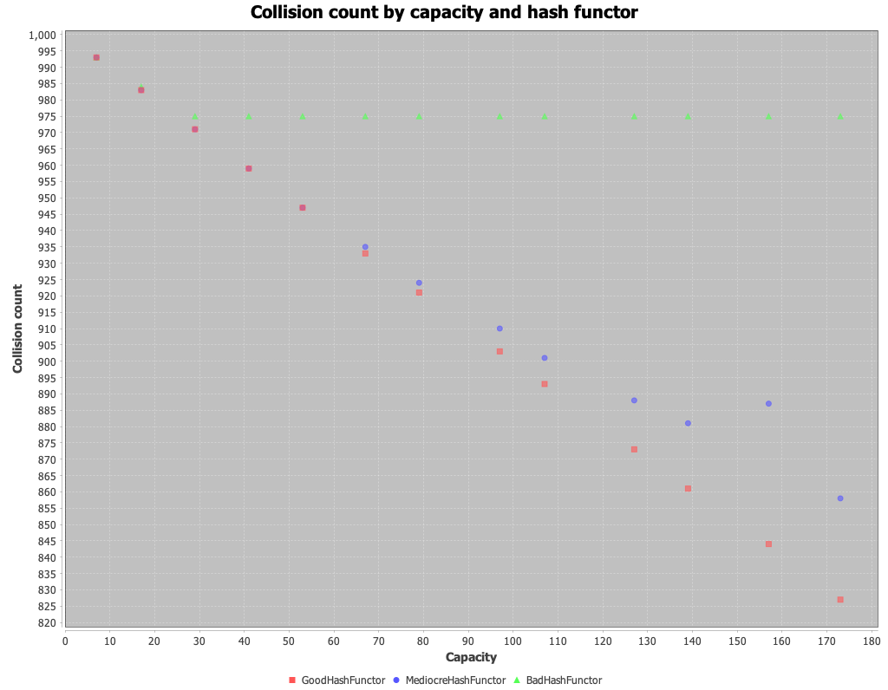
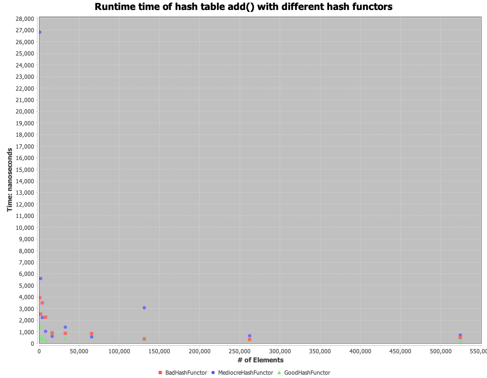
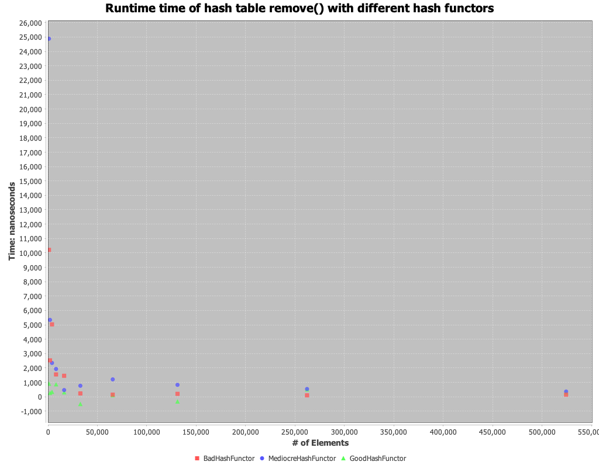
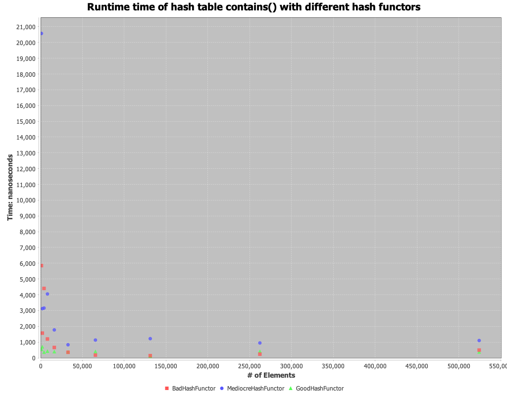

# Analysis

## Question 1

The `BadHashFunctor` functor simply returns the ASCII value of the first character in the string.
This will perform badly as uniqueness is limited to 256 ASCII characters, thus the underlying array would only require 256 slots.
Additionally, some characters would have frequent collisions due to their high usage in language, such as "s" since there are more english words beginning with the letter "s" than with any other letter.

## Question 2

The `MediocreHashFunctor` concatenates the individual ASCII values of each character in the input and converts up to the first 5 digits in the concatenated value to an integer.
For example:, `Hello` ASCII values are 72101108108111

* `H` - 72
* `e` - 101
* `l` - 108
* `o` - 111

The string hello receives the hash `72101`.

This functor should show reduced collisions when compared to `BadHashFunctor`. 
This is because we now use combinations of ASCII values instead of single ASCII values.
This brings our possible hash count beyond the previous 256 slots.
Collisions will only result when a string shares the same starting combination of characters.
For example, `hello` would collide with `hello world!`.
But unlike the `BadHashFunctor`; `h` and `he` will not share the same hash.

## Question 3

The `GoodHashFunctor` implements the djb2 algorithm.
This algorithm can produce a very large number of unique values and will essentially be globally unique thus collisions will only arise if the array backing the hash table is smaller than the number of possible values that will be added.

## Experiment

### Collision frequency for each hash function

Above is a chart which counts the collisions that occurred after inserting 1000 randomly generated names (first + last) into the hash table.
The capacities uses were all prime due to prime number's improved hash distributions.
The values are: 7, 17, 29, 41, 53, 67, 79, 97, 107, 127, 139, 157, 173.

For capacities 7 and 17 we see nearly the same number of collisions for each hash functor.
This makes sense as at these low capacities, we guarantee collisions with every hash functor and the only non-collisions would be the first elements to occupy a given linked list.
Given our input values are names which use the latin alphabet, the bad hash functor has 26 unique buckets it can possibly create.
Thus, the lower capacity arrays, cannot represent the unique number of hashes that even the bad hash functor is capable of producing.

At capacity 29, we see a leveling out of the `BadHashFunctor`. 
This makes sense because at this point each following capacity exceeds the 26 possible hashes that the `BadHashFunctor` can produce, thus from capacity 26 and on, there will always be 26 non-collisions (i.e. n - 26 collisions).

At capacity 67, we begin to see the `GoodHashFunctor` outperform the `MediocreHashFunctor`.
At appears that the `GoodHashFunctor` is able to match the number of non-collisions to the capacity of the array (i.e. the capacity is the limiting factor in reducing collisions).
Whereas the `MediocreHashFunctor` begins to not produce a unique enough number of hashes to populate each slot in the array.
I believe this is likely due to the mathematical relationship between the following prime numbers the possible set of hash values. 
As a follow-up experiment, it would be good to test the same functors with a different set of inputs that are not limited to just the latin alphabet and arrange as a name.
This would allow the `MediocreHashFunctor` to produce more unique hashes and hopefully show an improvement in collision counts.

### Method runtimes across different hash functors

The following charts show the runtimes of `add()`, `remove()`, and `contains()` methods using the 3 different hash functors and different input sizes.
The inputs were all randomly generated names (latin alphabet) and were unique.
The table uses a constant capacity of 31. 

Overall, each method regardless of hash functor, seemed to display an `O(1)` time complexity.
For `add()` this makes sense to me, as the linked lists are doubly linked lists, thus insertion into even a large bucket would be `O(1)`.
However, `remove()` and `contains()` displaying constant time complexity is surprising to me especially at larger inputs. 
The load factor at 500,000 elements is 500,000/31 = 16,129.
This means on average after inserting 500,000 elements into the table, each linked list would hold 16,129 elements.
Both `remove` and `contains` would need to iterate through a fair amount of items, so I would have expected a relationship closer to `O(logn)`.
However, considering java optimizations with the linked list implementation and each possible chain still being only a small fraction of the input, reaching an `O(1)` may be possible.
As a follow-up experiemnt, I would like to run the same test on larger inputs, worse hash functions, and a smaller capactiy.
To verify that the experimental design is correct, if I set the capacity to 1, then we should expect to see an `O(n)` runtime for `remove()` and `contains()`.

### Hash function performance

The following are the cost of each hash function

1. BadHashFunctor - `O(1)`
2. MediocreHashFunctor - `O(n)`
3. GoodHashFunctor - `O(n)`

Both the `BadHashFunctor` and the `GoodHashFunctor` behaved as expected.
The `BadHashFunctor` produced 26 unique hashes for the given names set and the array capacity was the limiting factor in reducing collisions when using the `GoodHashFunctor`.
However, I did expect `MediocreHashFunctor` to perform a little better.
As shown in the collision frequency chart above, we see the `MediocreHashFunctor` sometimes does not completely fill the array (i.e. did not produce the same number of unique hashes as the capacity).
I believe with a more curated input, we could ensure that every possible hash value is produced with the `MediocreHashFunctor`, so it seems `MediocreHashFunctor` is not a great hash functor to use when hashing names.