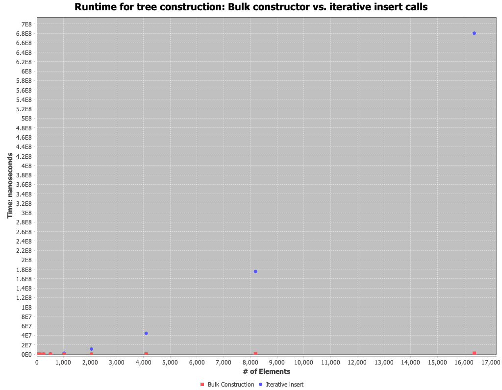
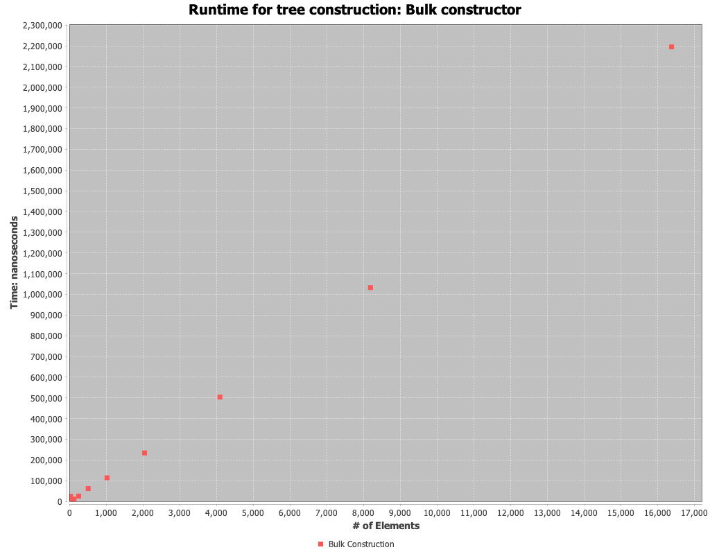
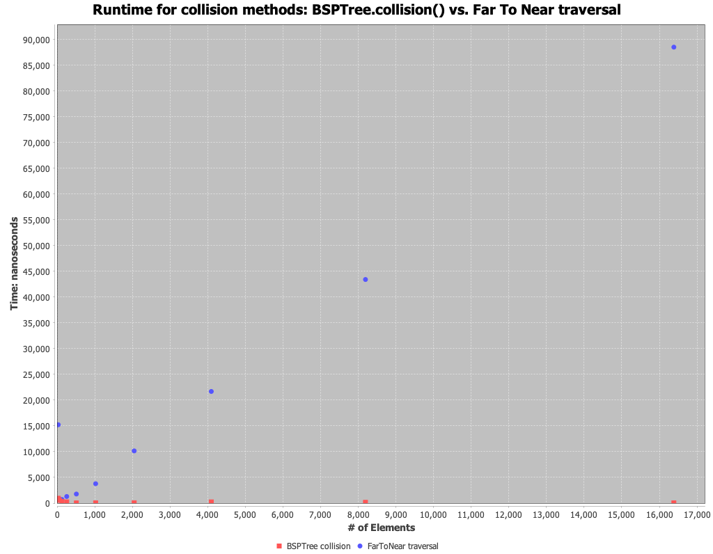

# Analysis

## Construction

For the worst case, I constructed the tree using an array of `Segement`s which are parallel to each other.

In the case of iterative insert (call bsptree.insert for each segment), I would expect a runtime of `O(n^2)` this is because the worst case would result in a completely unbalanced tree with the root node being the first element in the segment array and the following elements would populate only one side of the tree.
Thus, the expected runtime of `insert` would be `O(n)` and we call it `n` times resulting in `O(n^2)` for the entire tree construction.
For the bulk construction, I would expect a better runtime than iterative construction due to the random nature of the bulk constructor.
Instead of adding the first element in the segment array as the root, we randomly choose a Segment as the root.
If we happen to choose the middle element, we would end up with a perfectly balanced tree and any subsequent insert would have the time complexity, `O(log n)`.
Thus, I would expect the bulk constructor to have a time complexity of `O(n log n)`.

The experiment plotted above, partially supports my expectations. 
We do see that the iterative insert hase a much slower runtime than the bulk construction.
While the iterative insert does appear to begin to show an exponential trend, `O(n^2)`, the bulk construction is showing a very fast runtime, possibly `O(1)`-`O(n)`.
Since I am expecting a run time of `O(n log n)` for the bulk constructor, the `O(1)`-`O(n)`, does not make sense.
My guess is, the exponential scale of the iterative insert is overshadowing the bulk constructor trend.
To verify this, I plotted the bulk construction trend on its own:

Here we do see more of an `O(n log n)` trend, confirming my suspicion that the iterative scale was overshadowing the bulk constructor trend.
Overall, this experiment validates my expectations.
 
## Collision

For this experiment I use the same worst case described above, but then generated a random segment to use as the query for collision.
In the case of the BSP tree collision method I would expect a `O(log n)` runtime as this method will only search the side of the tree where there the randomly generated segment would be contained in.
Whereas, the near to far traversal collision method can potentially be `O(N)` as we are not selectively choosing which side of the tree to traverse and are instead comparing the randomly generated segment to every element in the tree until we find the collision.

The plotted trend is not what I expected. Primarily, the BSPTree collision running in what seems to be constant time.
I believe this is due to the experiment set up.
The randomly generated segment is generated using `Math.random()` which will only produced numbers between 0 and 1.
This will only produce a single possible collision with the same point around the origin in the input array.
Thus, depending on the tree construction, the collision method won't have to recurse far.

A better follow-up experiment would be to create a randomly generated array of segments for the input and in each timing iteration generate a new random segment to search for.
This would introduce more variation and possible collision cases and would likely move the time complexity to the aveerage case.