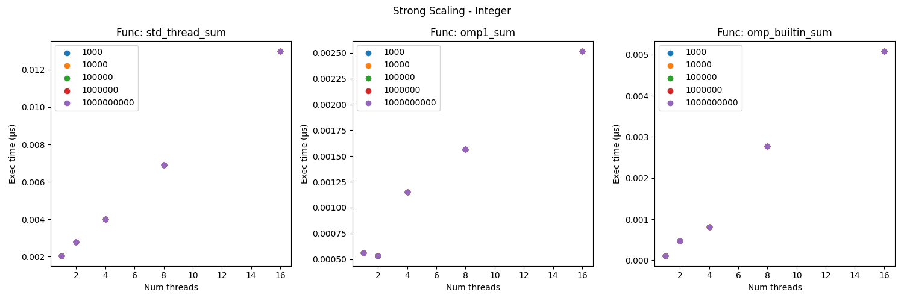
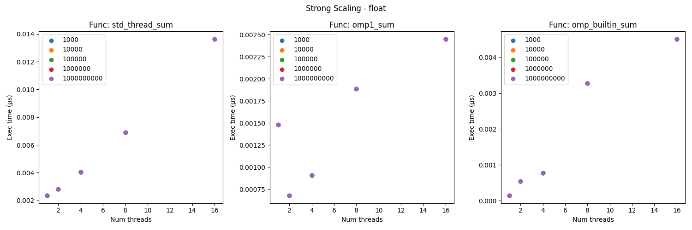
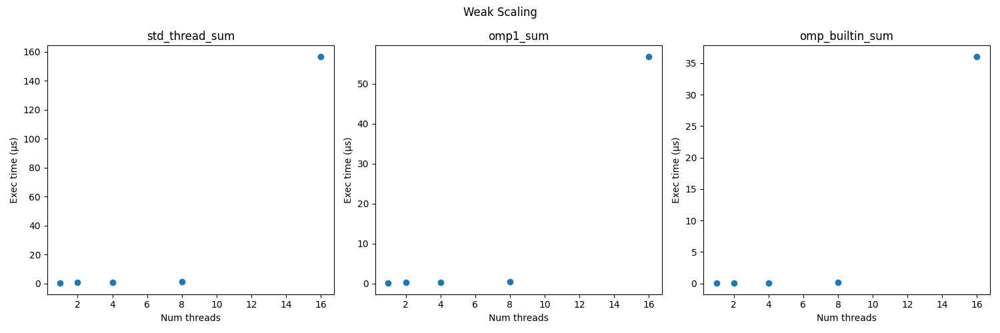

# Part 4: Analysis

## Strong Scaling

1. Do the curves match the ideal case?

No the curves do not match the ideal case.
The curves are showing more of a linear increasing trend, whereas I would expect a decreasing trend as the thread number increases.
The reason we are seeing the trend is likely due to the small amount of input sizes. 
If the input sizes were changed to be in the billions and tens of billions, then I suspect we would eventually see a decreasing trend.
Currently, the input sizes are too small to see a significant difference between threads, and the thread overhead for larger thread sizes is overshadowing the summation.

2. Does timing change if you sum integers vs. longs vs. floats?

It appears there is not significant change between floats and integers. 
However, this may change at larger input sizes.
I would suspect floating point arithmetic would increase the execution time slightly over integer summation.
The change may not be significant enough to see at the current input sizes.

## Weak Scaling

1. Do the curves match the ideal case?

The curves mostly match the ideal case. 
The ideal case would be a consistent time across threads and increasing input sizes.
This is because we proportionally increase threads and the input size for each time point, thus each thread is performing the same amount of work and in theory will take the same amount of time regardless of thread count.
Here we see consistent times from threads 1-8 and then a jump in time when jumping to 16 threads. 
This is expected as I do not have 16 cores on my machine.
Once we jump to 16 threads we are now introducing additional context switches, thus increasing processing time.

## Comparison

1. Which of the three methods performs best on each test?

Based on the strong scaling integer curves, it appears the OpenMP non-built in reduction approach is the most performant.
However, it is just barely more performant than the other methods.
I suspect this would change with larger input sizes, and we would see the best method as the built-in OpenMP reduction method.
I suspect the OpenMP non-built in method was more performant just by chance; I may have had more processes running at the time which causes additional context switches during execution of the other methods.
