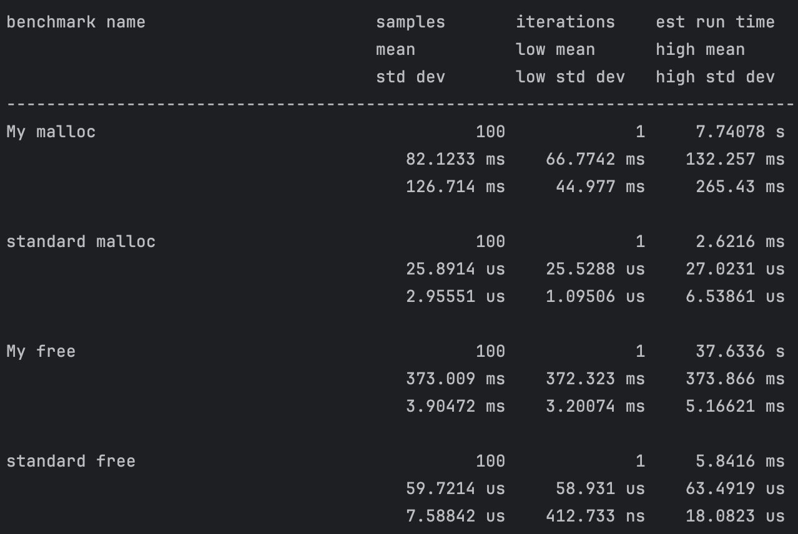

# Running the project

build first with `cmake`
```shell
mkir build && cd build && cmake ..
```

then run using the `tests` executable
```shell
./tests
```

This will run all tests and the benchmarks. 

# Benchmarks



# Conclusion

The benchmarks show both my `malloc` and `free` are significantly slower than their builtin counterparts; 3.17 and 6.25 times slower respectively.

The primary reason my malloc and free are slower is the large amount of fragmentation that this implementation introduces.
Each call to my malloc, allocates an entire page whereas the builtin malloc will allocate exactly the amount of bytes needed by partitioning a single page.
Consequently free then needs to free up an entire page in my implementation, whereas the builtin free only needs to free the amount of bytes allocated to whatever given object you are freeing.
Additionally, the single page per malloc call approach results in the hashtable needing to grow frequently as each call to malloc is equivalent to adding another entry into the hash table.

To speed up this implementation we can address both problems above by allocating a single page upfront in the allocator, partitioning the page into reserved sections based on data size, and then allocating sections of the page for the subsequent malloc calls.
By allocating a page upfront, no updates need to be made to the hash table for the following set of malloc calls.
Instead, you can just keep track of the next available pointer and return that pointer on the next call.
For free, you can use pointer arithmetic to quickly index into the allocated page and only free a small section of the page.
The internal hashtable would only need to store individual pages corresponding to several malloc calls.
This both reduces the number of times the hash table will grow and the amount of fragmentation introduced.