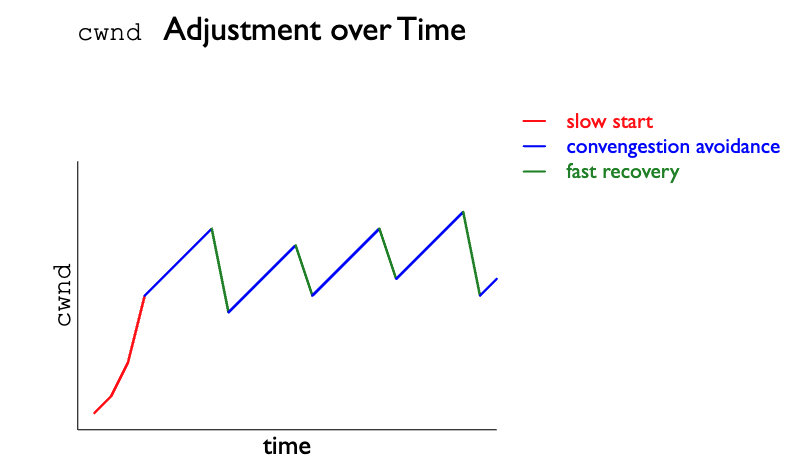

# Question 1

# Question 2

Flow control is a method of avoiding overwhelming the receiver in a connection, whereas congestion control is a method of avoiding overwhelming the network the messages are being sent on.
In the case of TCP:

Flow control is handled by communicating the receiver's window size to the sender. 
Window size lets the sender know how much data the receiver can accept at a given time, this corresponds to the receiver's buffer size.
A sender will not send more data than what the receiver can handle, except for the case where window size is 0 and the sender will attempt to send a single byte.
The sender will ensure that (the last byte sent - the last byte acked) <= the receiver's window side.
Effectively, this is a method of rate matching a sending a receiving party's messages.

Congestion control is handled by switching between 3 states:
1) Slow start
2) Congestion avoidance
3) Fast Recovery

This is done by adjusting congestion window, ssthresh, sending duplicate (3) ACKs after Out-of-Order bytes are received, and setting timeouts to handle when ACKs are not received.
In all states the congestion window and ssthreash values are adjusted, these values determine how much data a sender will send over the network at a given time.

In the slow start state, the amount of data sent is exponentially increased after each ACK until the congestion window is greater than ssthresh.
If there are no ACKs after a given amount of time, the congestion window size is halved and the slow start begins again.
If duplicate ACKs are received, then we move to fast recovery.
If each message is ACK'd until the congestion window is greater than ssthresh, then we move to the Congestion avoidance state.

In the congestion avoidance state the congestion window is linearly incremented for each ACK received, this in contrast to the exponential incrementation seen in the slow start state.
If 3 duplicate ACKs are received we move to the fast recovery state.
If no ACKs are received and there is a timeout, we move back to the slow start state.

In the Fast recovery state, if we receive a new ACK, the congestion window is reset to ssthresh and we return to congestion avoidance.
If a single duplicate ACK is received, we increase the congestion window by the maximum segment size and send a new message.
If there is a timeout, we set ssthresh to half of the congestion window, set the congestion window to the max segment size and return to the slow start state.

Overall this results in the following saw tooth behavior of adjusting congestion window size over time.

