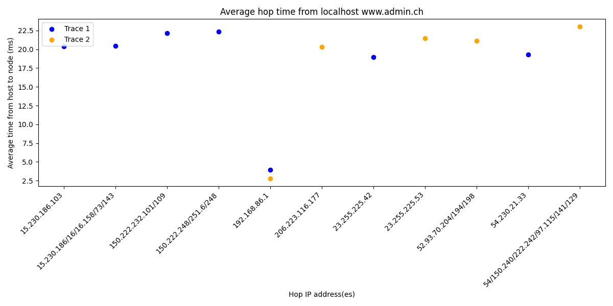

# Question 1

**Question:** What is the average queuing delay experienced by the 1000-byte packets?

The average queuing delay experienced by the 1000-byte packets can be determined with the assumption that the smallest provided delay occurred with a zero queuing delay.
Using the following formula

$$ delay_{total} = delay_{propagation} + delay_{transmission} + delay_{processing} + delay_{queuing} $$

we can set $ delay_{queuing} = 0 $ and ignore processing delay as it is negligible.
Using the minimum value of 2.8 ms for the 1000 byte packets, we can say 

$$ 2.8 = delay_{propagation} + delay_{transmission} $$

Using the initial equation, we can solve for $ delay_{queuing} $

$$ delay_{total} = 2.8 + delay_{queuing} $$

$$ delay_{queuing} = delay_{total} - 2.8 $$

Thus, calculating the average of the queuing delay time can be done using the following

$$  (\sum\limits_{i=0}^{N} delay_{total_{i}} - 2.8 )/ N $$

This results in an average 1000 byte packet queuing delay time of 3.66 ms.

**Question:** What are reasonable estimates of transmission and propagation delays that will be experienced by a packet of size 600 bytes sent through the link K?

To answer this we can use the intermediate equation above where we set the total delay time to the sum of propagation and transmission delays for both 500 and 1000 byte packets

$$ 2.4 = delay_{propagation} + delay_{transmission} $$

$$ 2.8 = delay_{propagation} + 2 *delay_{transmission} $$

Note that for the 1000-byte packets the total transmission delay is 2 times the transmission delay of the 500 byte packets.
This is because transmission delays are proportional to the packet size.
To get the transmission delay for the 500-byte packets, we can perform the following with the assumption that the propagation delay is equivalent across packet sizes. 

$$ 2.4 - delay_{transmission} = delay_{propagation} $$
$$ 2.8 - 2 *delay_{transmission} = delay_{propagation} $$
$$ 2.4 - delay_{transmission} = 2.8 - 2 *delay_{transmission} $$
$$ delay_{transmission} = 0.4 $$

Since 600 bytes is 20% larger than 500 bytes, we can then solve for the total transmission delay for the 600-byte packets 

$$ delay_{transmission} = 1.2 * 0.4 $$

Resulting in a transmission delay time of 0.48 ms

Using the initial total delay time and the transmission delay for the 500-bytes packets, we can find the propagation delay

$$ 2.4 = delay_{propagation} + 0.4 $$
$$ delay_{propagation} = 2 $$

Thus the propagation delay for the 600-byte packets is 2 ms.

# Question 2

### Part A

The below graph plots the average hop times of `traceroute` packets when tracing the path to www.admin.ch (the swiss governments landing page).
Note that in some cases, packets are sent to a different IP address during the same hop. 
In these instances, the ip addresses are merged to denote all addresses in the single hop.
For example, the addresses `15.230.186.158`, `15.230.16.73`, and `15.230.16.143` are merged into `15.230.186/16/16.158/73/143`.

### Part B

The first possible cause for this delay would be an increase in traffic at the time in which the packet with the high delay time was sent.
If there was a sudden increase in traffic at this time, then the slow packet could experience a higher queuing delay time than the other two packets.
The second possible cause for this delay would be also be due to in increase in traffic, but instead of seeing a spike in queuing time, the slow packet would have a spike in propagation delay.
During this time of increased traffic the slow packet could be sent to a router which is further away than the router where the other two packets were sent as a method of reducing congestion.
An increase in travel distance will increase the propagation delay.

### Question 3
The average queuing delay time can be derived using the formula 

$$ delay_{total} = delay_{propagation} + delay_{transmission} + delay_{processing} + delay_{queuing} $$

We can consider transmission, propagation, and processing delays are constant, thus the formula reduces to

$$ delay_{total} = c + delay_{queuing} $$

Since we can assume the minimum RTT value in our ping data, 18.388, corresponds to $ delay_{queuing} = 0 $, we can then say $ 18.388 = c$.
The average queuing delay can then be solved with 

$$  (\sum\limits_{i=0}^{N} delay_{total_{i}} - 18.388 )/ N $$

In the case of `ping.txt` this results in an average delay time of $ 5.95 ms $.
